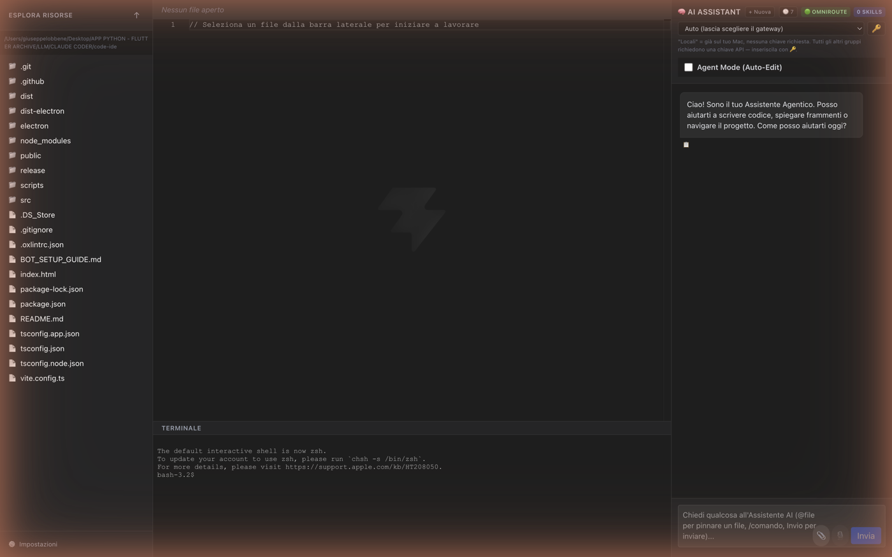
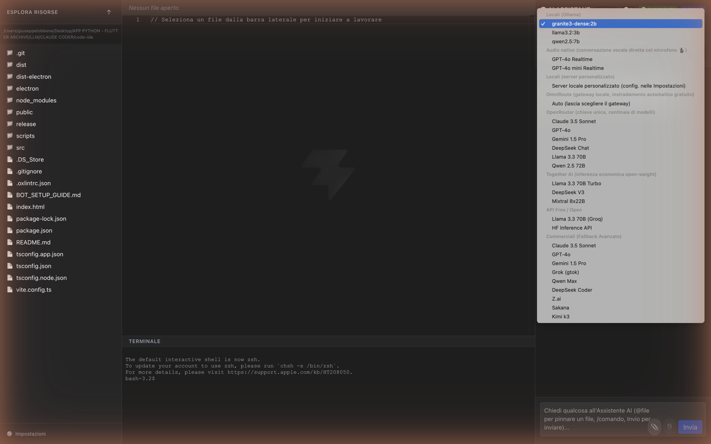
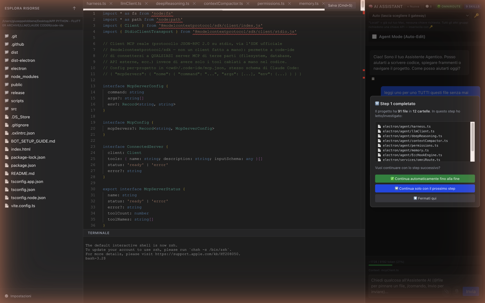
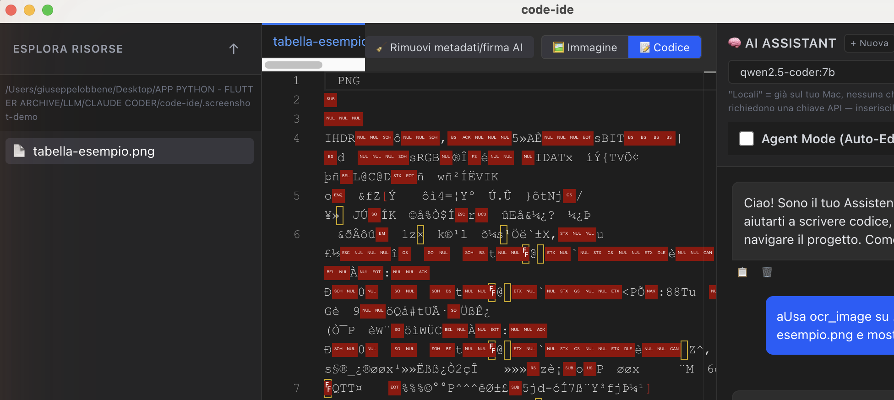

# Code-IDE

Desktop IDE (Electron + React + TypeScript) with an agentic AI assistant: multi-tab Monaco editor, integrated terminal, an agent harness with real tools (read/write/patch files, run commands, search the codebase, Git, GitHub, tests, sub-agents, web search), and routing to any LLM provider — local or cloud.



## Highlights

- **Real file access from normal chat, not just Agent Mode** — any model in the sidebar dropdown can now read any file in the currently open project on request (read-only tool-calling: `read_file`, `search_codebase`, `get_repo_map`, `get_diagnostics`, `ocr_image`, read-only browser tools), open it visibly in the center editor while reading it, and find bugs or suggest improvements when the model is capable enough. Executed in **steps** (max tool calls per round): if a broad request ("review every file") needs more than one step, the app pauses and shows a confirmation modal — continue one step, let it run autonomously to completion, or stop — instead of silently truncating. A local model that writes its tool call as plain text instead of populating the real `tool_calls` field (seen live with `qwen2.5-coder:7b`) is now recovered and actually executed instead of silently showing raw JSON as the final answer — same recovery logic already used in Agent Mode's harness.
- **OmniRoute integration that actually works from chat** — a local multi-provider LLM gateway (installed/started automatically) with free-tier auto-fallback routing. Fixed a real CORS limitation of the gateway (its real responses never carry `Access-Control-Allow-Origin`, only the preflight does) by routing the call through the Electron main process instead of a direct renderer `fetch()`. When the gateway routes to a different model than requested, the chat shows `🔀 routed to: <real model>`.
- **Native audio conversation** — a real microphone-to-microphone conversation with a model that natively supports audio, selectable from its own menu group: **OpenAI Realtime** (WebRTC, audio encode/decode handled by the browser) and **Gemini Live** (WebSocket with manual PCM16 framing — 16kHz mic input, 24kHz playback, hand-written in `NativeAudioPanel.tsx` since no library does this for Electron). Replaces an earlier Moshi/LiveKit integration removed because it only understood English.
- **Attachments** — a paperclip button to attach images, plain-text documents (code, `.md`, `.json`, `.csv`, etc.) or **PDF/DOCX** (real text extraction via `pdf-parse`/`mammoth`, routed through the Electron main process since parsing needs Node APIs) from anywhere on disk, not just files already inside the open project. Each attached file appears as a clickable chip in the chat bubble that opens its content in the center editor; a message with only an attachment and no typed text still gets a sensible default instruction instead of a blank prompt.
- **Local OCR with table reconstruction** (`ocr_image`) — extracts real text from an image (screenshot, scanned document) with PaddleOCR running locally via ONNX Runtime, no cloud service. When the image contains a table, a document-layout model (`ppu-doclayout`) locates the table region and the individual recognized text lines inside it are geometrically clustered into rows/columns and rendered back as a Markdown table — not just concatenated text.
- **Image viewer + AI-signature remover** — opening a `.png`/`.jpg`/etc. in the center editor now actually renders the image (it used to be read as UTF-8 text like any other file, showing a wall of mangled bytes). A toggle switches between that rendered view and a raw byte view — useful because AI image generators (Gemini, etc.) embed their signature/provenance as plain-text metadata chunks, which is exactly the readable "http", "google", "gemini" substrings you'd spot in the raw bytes. From the raw view, **"🧹 Remove metadata/AI signature"** strips those chunks in place (PNG `tEXt`/`zTXt`/`iTXt`/`eXIf`/`tIME`, JPEG `APP1`/`APP13`/`COM`) without touching a single pixel byte — pure-JS chunk/marker parsing, no native image library. A confirmation modal reports what was removed, then the button disappears once the file is confirmed clean.
- **AI-tag cleanup on code too, not just images** — a "Pulizia: Disabled / AI signatures only / Everything" dropdown in the editor toolbar (default: AI signatures only) applies on every save: strips LLM-typical placeholder comments (`// ... existing code ...`, `// Sure, I can help with that`, etc.) and reformats with Prettier (the project's own `.prettierrc` if present). The same dropdown also switches the image stripper from "remove everything" to "remove only chunks matching a known AI-tool signature" (Midjourney, DALL-E, C2PA, XMP, ...), leaving unrelated metadata (e.g. a real `Author` field) untouched.
- **"Reveal in Finder"** icon next to every file in the sidebar (hover to show it) — jumps straight to that file in the OS file manager.
- **Browser Agent, two backends** (`browser_navigate`/`browser_screenshot`/`browser_eval`/`browser_click`/`browser_smart_locate`/`browser_solve_cloudflare`): a real Chromium **window** (Electron's own, realistic UA, fast to start — the default, for testing the app you're developing locally where anti-bot isn't a concern), and, with `browser_navigate stealthy:true`, a genuinely separate Chromium/Chrome **process** driven by `patchright` (the same CDP anti-detection patches D4Vinci/Scrapling uses, here via its actively-maintained Node port instead of Electron's own webContents — verified live: `navigator.webdriver` reports `false`, unlike a plain automated browser). `browser_smart_locate` (adaptive element location via Ratcliff/Obershelp similarity across tag/text/attributes/parent/siblings) and `browser_solve_cloudflare` (Turnstile checkbox click-through) work on whichever backend is currently active. Web scraping of a single known URL (`fetch_webpage`) is a separate, simpler tool backed by an auto-installed Scrapling (Python, isolated venv, lazily bootstrapped on first use like the InvokeAI integration) — use it instead of the Browser Agent when you just need a page's content, not an interactive session.
- **Copy button on every AI response**, not just on your own prompts.
- **Remembers your last selected model** across restarts.
- **Editor** with automatic opening and live highlighting of the lines the agent is writing
- **Integrated terminal** (xterm.js + node-pty) that also shows commands run by the agent
- **Agent Mode**: tool-calling harness with `edit_file`, `patch_file` (targeted edits without rewriting the whole file), `delete_file`, `move_file`, `create_folder`, `delete_folder` (recursive, blocked from touching the project root or anything outside it), `read_file`, `search_codebase`, `get_repo_map` (compact AST map + file dependencies), `get_diagnostics` (real static analysis — the TypeScript Compiler API for `.ts`/`.tsx`/`.js`/`.jsx`, `mypy`/`py_compile` for `.py`, `cargo check` for `.rs`, `go vet` for `.go`, run through the user's real login shell so pyenv/rustup-installed tools are found, same fix as the integrated terminal), `ocr_image`, `browser_navigate`/`browser_screenshot`/`browser_eval`/`browser_click`/`browser_smart_locate`/`browser_solve_cloudflare` (Browser Agent — Electron window by default, optional separate stealth Chromium/Chrome process), `manage_git`, `save_memory`, `publish_to_github`, `run_and_verify_tests`, `invoke_subagent` (read-only sub-agents, with diagnostics, OCR and read-only browser access), `web_search`, `fetch_webpage`
- **Automatic Agent Mode management** — a broad Italian+English write-intent heuristic detects when a chat message (in normal, non-Agent-Mode chat) actually asks for a change, and shows a banner offering to turn Agent Mode on before sending instead of the model just describing what it *would* do; after a task that modified files, Agent Mode auto-disables itself only once the changes are genuinely **verified** (a real `get_diagnostics`/`run_and_verify_tests` result came back clean), not merely once the model claims to be done.
- **Delete button on every chat message** (both yours and the assistant's), next to copy.
- **Plan Mode**: exploration-only mode (read tools only) that produces a plan requiring explicit approval before the agent can write or execute anything
- **Deep Reasoning**: a genuine two-level Monte Carlo Tree Search — N independent branches investigate the real code in parallel and each proposes a solution; every proposal is actually applied transiently (always reverted right after) and scored with a real type-check — partial-credit scoring, not a text opinion; the most promising-but-imperfect branches get refined with a second pass based on real feedback and re-scored, then the highest-scoring node wins. The "Supreme Court" mode (3 judges + syntactic screening + an LLM judge vote) remains available as a lighter option in `deepReasoning.ts`
- **Models**: local Ollama and LM Studio (auto-detected), OmniRoute (local gateway to 1200+ models, auto-installed/started with a random password), OpenRouter, Together AI, plus direct APIs of major commercial providers
- **Ollama model manager**: download/remove models straight from Settings, with real progress
- **Local skills**: JSON files in `src/skills/`, keyword-matched, adapted from real Claude Code community skills
- **Telegram/WhatsApp bots**: trigger the same Agent Mode remotely (restricted to the configured chat ID)
- **Safety blocklist** for destructive terminal commands (`rm -rf /`, `mkfs`, `dd of=/dev/`, fork bombs, `diskutil erase`, `sudo`, etc.), since the agent runs fully autonomously without confirmation
- **Per-task LLM call cap** (`AGENT_MAX_LLM_CALLS_PER_RUN`, default 150) to prevent runaway loops and uncontrolled spend on paid models
- **`publish_to_github` refuses to publish** if it detects sensitive-looking files (`.env`, private keys, credentials) not yet ignored by `.gitignore` among the staged changes
- **Persistent sessions**: the conversation with the agent survives app restarts (saved per project in userData), with browsable history and multiple conversations
- **Live todo list** (`write_todos`): the agent declares and updates the plan of a multi-step task in real time, visible in the sidebar
- **Usage tracking**: real tokens/calls per model (read from actual responses, not estimated), persisted and browsable in Settings — not a $ cost (provider pricing changes too often to keep reliably in sync)
- **Checkpoint/rewind**: every agent run that modifies files (`edit_file`/`patch_file`/`delete_file`/`move_file`/`delete_folder`) creates an automatic checkpoint; a button on the final message reverts ALL changes from that run as one atomic unit. `delete_folder` snapshots every text file inside the tree before removing it (binary files are skipped — restoring bytes read as UTF-8 would corrupt them, so they're deleted but not reversible). Doesn't cover `run_terminal_command` side effects, too varied to track reliably without a full sandbox
- **Automatic context compaction**: when a long task approaches the model's estimated context window, older messages are automatically summarized via a dedicated LLM call (system prompt and recent messages always preserved), instead of silently overflowing the context
- **MCP (Model Context Protocol)**: real connection (JSON-RPC over stdio, via `@modelcontextprotocol/sdk`) to any third-party MCP server configured in `<project>/.code-ide/mcp.json` — its tools are added automatically to the agent's (prefixed `mcp__<server>__<tool>`), manageable from Settings
- **Reads `AGENTS.md`/`CLAUDE.md`** from the root of the open project if present (the convention shared by Antigravity, Claude Code and Cursor) and injects them into the system prompt — a repo that already declares its own rules doesn't need to repeat them out loud every session
- **Background terminal commands** (`run_background_command`/`check_background_command`/`stop_background_command`): for long-running processes (dev servers, watch mode) that would otherwise always fail `run_terminal_command`'s fixed 30s timeout
- **Granular project permissions** (`.code-ide/settings.json`): tool allow/deny list by name (wildcards for a whole MCP server, e.g. `mcp__name__*`) and by file path (`allowedPaths`/`deniedPaths`, glob), plus the Plan Mode/full-access toggle
- **Persistent sub-agents** (`.code-ide/agents/*.md`, `description` frontmatter + body as system prompt): reusable specialized personas across sessions, invocable by name with `invoke_subagent` instead of reinventing them ad hoc every time
- **Slash commands** (`.code-ide/commands/*.md`): reusable prompt templates invocable from chat with `/name arguments` — `{{args}}` in the file body is replaced with the text after the command name
- **Telegram/WhatsApp bots**: `/checkpoints` lists a project's checkpoints, `/revert [n]` undoes the changes of a remotely-triggered run (checkpoint/rewind used to be desktop-UI only)







## Development

```bash
npm install
npm run dev
```

## Build / distribution

```bash
npm run dist           # current platform
npm run dist -- --mac  # macOS (.dmg)
npm run dist -- --win  # Windows (.exe)
```

## Project hooks

Code-IDE supports custom hooks for agent lifecycle events, similar to Claude Code hooks. Create `.code-ide/hooks.json` in the opened project's root:

```json
{
  "hooks": {
    "PreToolUse": [
      {
        "id": "log-tool-use",
        "matcher": "*",
        "description": "Example: log every tool the agent invokes",
        "hooks": [
          { "type": "command", "command": "echo \"$ECC_CONTEXT\" >> agent-tool-log.txt" }
        ]
      }
    ]
  }
}
```

Available events: `SessionStart`, `SessionEnd`, `PreToolUse`, `PostToolUse`, `PostToolUseFailure`, `Stop`. `matcher` accepts `"*"` (all tools) or a `|`-separated list (e.g. `"edit_file|patch_file"`). Every command receives the `CODE_IDE_PROJECT_ROOT` (project root) and `ECC_CONTEXT` (JSON with the tool's arguments or result, depending on the event) environment variables, and runs with cwd at the project root. A hook can be `"async": true` (fire-and-forget) or synchronous (the agent waits for completion before continuing).

## Project MCP servers

Create `.code-ide/mcp.json` in the opened project's root to connect the agent to third-party MCP servers (same schema as Claude Code):

```json
{
  "mcpServers": {
    "filesystem": {
      "command": "npx",
      "args": ["-y", "@modelcontextprotocol/server-filesystem", "/allowed/path"],
      "env": {}
    }
  }
}
```

Discovered tools (via `tools/list` at connection time) are added automatically to the agent's under the name `mcp__<server>__<tool>`. Connection status and manual reload live in Settings → MCP Servers.

## Granular permissions

Create `.code-ide/settings.json` in the project root to restrict what the agent can do:

```json
{
  "permissions": {
    "deny": ["publish_to_github", "mcp__untrusted__*"],
    "allowedPaths": ["src/**", "electron/**"],
    "deniedPaths": ["**/.env*", "**/secrets/**"]
  }
}
```

`deny` blocks tools by exact name (or a trailing `*` for a whole group, e.g. all tools of one MCP server). `allowedPaths`, if present and non-empty, restricts `edit_file`/`patch_file`/`read_file` (and any tool with a `filePath`/`path` argument) to ONLY those paths; `deniedPaths` always takes precedence. Reloaded automatically on every new task.

## Persistent sub-agents and slash commands

`.code-ide/agents/<name>.md` defines a reusable sub-agent (invocable with `invoke_subagent` passing `agentName`, instead of reinventing the persona every time):

```markdown
---
description: Audits code for security vulnerabilities
---
You are an expert Security Auditor. Look for SQL injection, XSS, hardcoded secrets, unsanitized shell commands. Always cite the exact line.
```

`.code-ide/commands/<name>.md` defines a slash command invocable from chat with `/name arguments` (autocomplete included); `{{args}}` in the body is replaced with the text after the command name:

```markdown
---
description: Fixes a bug in the given file
---
Analyze and fix this bug: {{args}}

First read the relevant file with read_file, then apply the minimal fix with edit_file.
```

## Configuration (.env)

See [BOT_SETUP_GUIDE.md](./BOT_SETUP_GUIDE.md) for Telegram/WhatsApp. Other optional variables: `GITHUB_TOKEN`, `PERPLEXITY_API_KEY`, `OMNIROUTE_API_KEY`, `LOCAL_LLM_BASE_URL`, `OPENROUTER_API_KEY`, `TOGETHER_API_KEY`, `AGENT_MAX_ITERATIONS`, `AGENT_TERMINAL_DISABLED`, `AGENT_MAX_LLM_CALLS_PER_RUN`, `AGENT_CONTEXT_WINDOW_TOKENS` (estimated context window for auto-compaction when the model isn't in the known table), `MCP_CONNECT_TIMEOUT_MS` (default 15000, per-server MCP connection timeout).

---

# Code-IDE (Italiano)

IDE desktop (Electron + React + TypeScript) con assistente AI agentico: editor Monaco multi-scheda, terminale integrato, un harness agentico con tool reali (leggere/scrivere/patchare file, eseguire comandi, cercare nel codice, Git, GitHub, test, sub-agenti, ricerca web), e instradamento verso qualunque provider LLM — locale o cloud.

## Novità principali

- **Accesso reale ai file anche dalla chat normale, non solo in Agent Mode** — qualunque modello nel menu a tendina può ora leggere davvero qualunque file del progetto aperto su richiesta (tool-calling di sola lettura: `read_file`, `search_codebase`, `get_repo_map`, `get_diagnostics`, `ocr_image`, tool browser di sola lettura), aprendolo visivamente nell'editor centrale mentre lo legge, e trovare bug o suggerire migliorie quando il modello ne è capace. Eseguito **a step** (numero massimo di chiamate a tool per round): se una richiesta ampia ("revisiona ogni file") ne richiede più di uno, l'app si ferma e mostra una modale di conferma — continua un solo step, lascia proseguire in autonomia fino alla fine, o fermati — invece di troncare in silenzio. Un modello locale che scrive la chiamata a tool come testo semplice invece di popolare davvero il campo `tool_calls` (osservato dal vivo con `qwen2.5-coder:7b`) viene ora recuperato ed eseguito per davvero invece di mostrare in silenzio il JSON grezzo come risposta finale — stessa logica di recupero già usata nell'harness di Agent Mode.
- **Integrazione OmniRoute che funziona davvero dalla chat** — gateway locale multi-provider (installato/avviato automaticamente) con instradamento automatico verso pool gratuiti. Corretto un vero limite CORS del gateway (le sue risposte reali non includono mai `Access-Control-Allow-Origin`, solo il preflight sì) instradando la chiamata dal processo main di Electron invece che da un `fetch()` diretto nel renderer. Quando il gateway instrada verso un modello diverso da quello richiesto, la chat mostra `🔀 instradato verso: <modello reale>`.
- **Conversazione vocale nativa** — una vera conversazione microfono-a-microfono con un modello che supporta audio nativo, selezionabile dal suo gruppo dedicato nel menu: **OpenAI Realtime** (WebRTC, encode/decode audio gestiti dal browser) e **Gemini Live** (WebSocket con framing PCM16 manuale — mic a 16kHz in ingresso, riproduzione a 24kHz, scritto a mano in `NativeAudioPanel.tsx` perché nessuna libreria lo fa per Electron). Sostituisce una precedente integrazione Moshi/LiveKit rimossa perché capiva solo l'inglese.
- **Allegati** — un bottone graffetta per allegare immagini, documenti di testo semplice (codice, `.md`, `.json`, `.csv`, ecc.) o **PDF/DOCX** (estrazione testo reale via `pdf-parse`/`mammoth`, instradata sul processo main di Electron perché il parsing richiede API Node) da qualunque punto del disco, non solo file già dentro al progetto aperto. Ogni file allegato appare come chip cliccabile nella bolla di chat che ne apre il contenuto nell'editor centrale; un messaggio con solo un allegato e nessun testo digitato riceve comunque un'istruzione di default sensata invece di un prompt vuoto.
- **OCR locale con ricostruzione tabelle** (`ocr_image`) — estrae il testo reale da un'immagine (screenshot, documento scansionato) con PaddleOCR eseguito localmente via ONNX Runtime, nessun servizio cloud. Se l'immagine contiene una tabella, un modello di analisi del layout (`ppu-doclayout`) localizza il riquadro della tabella e le singole righe di testo riconosciute al suo interno vengono raggruppate geometricamente in righe/colonne e restituite come tabella Markdown — non solo testo concatenato.
- **Visualizzatore immagini + rimozione firma AI** — aprire un `.png`/`.jpg`/ecc. nell'editor centrale ora mostra davvero l'immagine (prima veniva letta come testo UTF-8 come qualunque altro file, un muro di byte corrotti). Un toggle passa tra quella vista renderizzata e una vista a byte grezzi — utile perché i generatori di immagini AI (Gemini, ecc.) incorporano la loro firma/provenienza come metadati testuali semplici, esattamente le sottostringhe leggibili "http", "google", "gemini" che si notano nei byte grezzi. Dalla vista grezza, **"🧹 Rimuovi metadati/firma AI"** elimina quei chunk sul posto (PNG `tEXt`/`zTXt`/`iTXt`/`eXIf`/`tIME`, JPEG `APP1`/`APP13`/`COM`) senza toccare un solo byte di pixel — parsing puro JS di chunk/marker, nessuna libreria immagini nativa. Una modale di conferma riporta cosa è stato rimosso, poi il pulsante sparisce una volta che il file risulta pulito.
- **Pulizia firma AI anche sul codice, non solo sulle immagini** — un menu a tendina "Pulizia: Disabilitata / Solo Firme AI / Tutto" nella toolbar dell'editor (default: solo firme AI) si applica a ogni salvataggio: rimuove i commenti segnaposto tipici degli LLM (`// ... existing code ...`, `// Sure, I can help with that`, ecc.) e riformatta con Prettier (usando il `.prettierrc` del progetto se presente). Lo stesso menu passa anche il rimotore di metadati immagine da "rimuovi tutto" a "rimuovi solo i chunk che combaciano con una firma nota di uno strumento AI" (Midjourney, DALL-E, C2PA, XMP, ...), lasciando intatti metadati non collegati (es. un vero campo `Author`).
- Icona **"Mostra nel Finder"** accanto a ogni file nella barra laterale (compare al passaggio del mouse) — porta dritto a quel file nel file manager del sistema.
- **Browser Agent, due backend** (`browser_navigate`/`browser_screenshot`/`browser_eval`/`browser_click`/`browser_smart_locate`/`browser_solve_cloudflare`): una vera **finestra** Chromium (quella di Electron stessa, user-agent realistico, avvio rapido — il default, per testare l'app che stai sviluppando in locale dove l'anti-bot non è un problema), e, con `browser_navigate stealthy:true`, un **processo** Chromium/Chrome davvero separato pilotato da `patchright` (le stesse patch anti-detection CDP usate da D4Vinci/Scrapling, qui tramite il suo porting Node attivamente mantenuto invece della webContents di Electron — verificato dal vivo: `navigator.webdriver` risulta `false`, a differenza di un browser automatizzato normale). `browser_smart_locate` (localizzazione adattiva degli elementi via similarità Ratcliff/Obershelp su tag/testo/attributi/genitore/fratelli) e `browser_solve_cloudflare` (click sulla checkbox Turnstile) operano su qualunque backend sia attivo al momento. Lo scraping di un singolo URL noto (`fetch_webpage`) è un tool separato e più semplice, basato su uno Scrapling auto-installato (Python, venv isolato, avviato pigramente al primo utilizzo come l'integrazione InvokeAI) — usalo al posto del Browser Agent quando ti serve solo il contenuto di una pagina, non una sessione interattiva.
- **Bottone copia su ogni risposta dell'AI**, non solo sui propri prompt.
- **Ricorda l'ultimo modello selezionato** tra un riavvio e l'altro.
- **Editor multi-scheda** con apertura automatica ed evidenziazione live delle righe che l'agente sta scrivendo
- **Terminale integrato** (xterm.js + node-pty) che mostra anche i comandi eseguiti dall'agente
- **Agent Mode**: harness a tool-calling con `edit_file`, `patch_file` (modifica mirata senza riscrivere l'intero file), `delete_file`, `move_file`, `create_folder`, `delete_folder` (ricorsivo, bloccato dal toccare la root del progetto o qualunque cosa al suo esterno), `read_file`, `search_codebase`, `get_repo_map` (mappa AST compatta + dipendenze tra file), `get_diagnostics` (vera analisi statica — TypeScript Compiler API per `.ts`/`.tsx`/`.js`/`.jsx`, `mypy`/`py_compile` per `.py`, `cargo check` per `.rs`, `go vet` per `.go`, eseguiti passando per la vera shell di login dell'utente così i tool installati via pyenv/rustup vengono trovati, stesso fix già usato per il terminale integrato), `ocr_image`, `browser_navigate`/`browser_screenshot`/`browser_eval`/`browser_click`/`browser_smart_locate`/`browser_solve_cloudflare` (Browser Agent — finestra Electron per default, opzionale processo Chromium/Chrome separato in modalità stealth), `manage_git`, `save_memory`, `publish_to_github`, `run_and_verify_tests`, `invoke_subagent` (sub-agenti in sola lettura, con accesso anche a diagnostica, OCR e browser read-only), `web_search`, `fetch_webpage`
- **Gestione automatica di Agent Mode** — un'euristica ampia (italiano+inglese) di rilevamento intento-di-scrittura individua quando un messaggio in chat normale (fuori da Agent Mode) chiede in realtà una modifica, e mostra un banner che propone di attivare Agent Mode prima di inviare invece di far semplicemente descrivere al modello cosa *farebbe*; dopo un task che ha modificato file, Agent Mode si disattiva da solo solo quando le modifiche sono davvero **verificate** (un risultato reale di `get_diagnostics`/`run_and_verify_tests` è tornato pulito), non appena il modello dichiara di aver finito.
- **Pulsante elimina su ogni messaggio di chat** (sia tuoi che dell'assistente), accanto a copia.
- **Plan Mode**: modalità di sola esplorazione (tool di lettura soltanto) che produce un piano da approvare esplicitamente prima che l'agente possa scrivere/eseguire qualcosa
- **Deep Reasoning**, attivata dalla stessa modalità, è un vero Monte Carlo Tree Search a due livelli: N rami indipendenti investigano il codice reale in parallelo e propongono una soluzione ciascuno; ogni proposta viene DAVVERO applicata in modo transitorio (sempre ripristinata subito dopo) e valutata con una vera diagnostica di tipo — punteggio a *partial credit*, non un voto testuale; i rami più promettenti ma imperfetti vengono raffinati con un secondo giro basato sul feedback reale e ri-valutati, poi vince il nodo con il punteggio più alto in assoluto. La modalità "Supreme Court" (3 giudici + screening sintattico + voto di un giudice LLM) resta disponibile come funzione più leggera in `deepReasoning.ts`
- **Modelli**: Ollama e LM Studio locali (rilevati automaticamente), OmniRoute (gateway locale a 1200+ modelli, installato/avviato automaticamente con password casuale), OpenRouter, Together AI, più le API dirette dei principali provider commerciali
- **Gestore modelli Ollama**: scarica/rimuovi modelli direttamente dal pannello Impostazioni, con progress reale
- **Skill locali**: file JSON in `src/skills/` attivati per keyword-matching, adattati da skill reali della community Claude Code
- **Bot Telegram/WhatsApp**: attivano lo stesso Agent Mode da remoto (accesso ristretto al chat ID configurato)
- **Blocklist di sicurezza** per comandi terminale distruttivi (`rm -rf /`, `mkfs`, `dd of=/dev/`, fork bomb, `diskutil erase`, `sudo`, ecc.), dato che l'agente esegue in piena autonomia senza conferma
- **Tetto sulle chiamate LLM per task** (`AGENT_MAX_LLM_CALLS_PER_RUN`, default 150) per evitare cicli fuori controllo e spesa incontrollata su modelli a pagamento
- **`publish_to_github` blocca la pubblicazione** se rileva file dall'aspetto sensibile (`.env`, chiavi private, credenziali) non ancora ignorati da `.gitignore` tra le modifiche che verrebbero committate
- **Sessioni persistenti**: la conversazione con l'agente sopravvive alla chiusura dell'app (salvata per progetto in userData), con cronologia consultabile e conversazioni multiple
- **Todo list live** (`write_todos`): l'agente dichiara e aggiorna in tempo reale il piano di un task multi-step, visibile nella sidebar
- **Tracking utilizzo**: token/chiamate reali per modello (letti dalle risposte effettive, non stimati), persistiti e consultabili nel pannello Impostazioni — non un costo in $ (i prezzi dei provider cambiano troppo spesso per tenerli sincronizzati in modo affidabile)
- **Checkpoint/rewind**: ogni run dell'agente che modifica file (`edit_file`/`patch_file`/`delete_file`/`move_file`/`delete_folder`) crea un checkpoint automatico; un pulsante sul messaggio finale permette di annullare TUTTE le modifiche di quel run come unità atomica, ripristinando i file al loro stato precedente. `delete_folder` cattura ogni file di testo dentro l'albero prima di eliminarlo (i file binari vengono saltati — ripristinare byte letti come UTF-8 li corromperebbe, quindi vengono eliminati ma non sono recuperabili). Non copre gli effetti di `run_terminal_command`, troppo vari per essere tracciati in modo affidabile senza una sandbox completa
- **Compattazione automatica del contesto**: quando un task lungo si avvicina alla finestra di contesto stimata del modello, i messaggi più vecchi vengono automaticamente riassunti con una chiamata LLM dedicata (system prompt e messaggi recenti sempre preservati), invece di saturare/superare silenziosamente il contesto
- **MCP (Model Context Protocol)**: connessione reale (JSON-RPC su stdio, via `@modelcontextprotocol/sdk`) a qualunque server MCP di terze parti configurato in `<progetto>/.code-ide/mcp.json` — i suoi tool si aggiungono automaticamente a quelli dell'agente (prefissati `mcp__<server>__<tool>`), gestibili dal pannello Impostazioni
- **Legge `AGENTS.md`/`CLAUDE.md`** dalla root del progetto aperto se presenti (la convenzione condivisa da Antigravity, Claude Code e Cursor) e li inietta nel system prompt — un repo che dichiara già le proprie regole non deve ripeterle a voce ogni sessione
- **Comandi terminale in background** (`run_background_command`/`check_background_command`/`stop_background_command`): per processi long-running (dev server, watch mode) che altrimenti farebbero sempre fallire `run_terminal_command` al suo timeout fisso di 30s
- **Permessi granulari di progetto** (`.code-ide/settings.json`): allowlist/denylist di tool per nome (anche wildcard per un intero server MCP, es. `mcp__nome__*`) e di percorsi file (`allowedPaths`/`deniedPaths`, glob), oltre al binario Plan Mode/accesso completo
- **Sub-agenti persistenti** (`.code-ide/agents/*.md`, frontmatter `description` + corpo come system prompt): personas specializzate riusabili tra sessioni, richiamabili per nome con `invoke_subagent` invece di reinventarle ad-hoc ogni volta
- **Comandi slash** (`.code-ide/commands/*.md`): template di prompt riusabili invocabili dalla chat con `/nome argomenti` — `{{args}}` nel corpo del file viene sostituito col testo dopo il nome del comando
- **Bot Telegram/WhatsApp**: `/checkpoints` elenca i checkpoint del progetto, `/revert [n]` annulla le modifiche di un run innescato da remoto (prima il checkpoint/rewind era visibile solo nella UI desktop)

## Sviluppo

```bash
npm install
npm run dev
```

## Build / distribuzione

```bash
npm run dist           # piattaforma corrente
npm run dist -- --mac  # macOS (.dmg)
npm run dist -- --win  # Windows (.exe)
```

## Hook di progetto

Code-IDE supporta hook personalizzati per evento del ciclo di vita dell'agente, in modo analogo agli hook di Claude Code. Crea `.code-ide/hooks.json` nella root del progetto aperto:

```json
{
  "hooks": {
    "PreToolUse": [
      {
        "id": "log-tool-use",
        "matcher": "*",
        "description": "Esempio: logga ogni tool invocato dall'agente",
        "hooks": [
          { "type": "command", "command": "echo \"$ECC_CONTEXT\" >> agent-tool-log.txt" }
        ]
      }
    ]
  }
}
```

Eventi disponibili: `SessionStart`, `SessionEnd`, `PreToolUse`, `PostToolUse`, `PostToolUseFailure`, `Stop`. `matcher` accetta `"*"` (tutti i tool) o un elenco separato da `|` (es. `"edit_file|patch_file"`). Ogni comando riceve le variabili d'ambiente `CODE_IDE_PROJECT_ROOT` (root del progetto) ed `ECC_CONTEXT` (JSON con gli argomenti del tool o il risultato, a seconda dell'evento), e gira con cwd nella root del progetto. Un hook può essere `"async": true` (fire-and-forget) o sincrono (l'agente attende il completamento prima di proseguire).

## Server MCP di progetto

Crea `.code-ide/mcp.json` nella root del progetto aperto per connettere l'agente a server MCP di terze parti (stesso schema di Claude Code):

```json
{
  "mcpServers": {
    "filesystem": {
      "command": "npx",
      "args": ["-y", "@modelcontextprotocol/server-filesystem", "/percorso/consentito"],
      "env": {}
    }
  }
}
```

I tool scoperti (via `tools/list` al momento della connessione) si aggiungono automaticamente a quelli dell'agente col nome `mcp__<server>__<tool>`. Stato connessione e ricarica manuale sono nel pannello Impostazioni → Server MCP.

## Permessi granulari

Crea `.code-ide/settings.json` nella root del progetto per restringere cosa l'agente può fare:

```json
{
  "permissions": {
    "deny": ["publish_to_github", "mcp__untrusted__*"],
    "allowedPaths": ["src/**", "electron/**"],
    "deniedPaths": ["**/.env*", "**/secrets/**"]
  }
}
```

`deny` vieta tool per nome esatto (o con un `*` finale per un intero gruppo, es. tutti i tool di un server MCP). `allowedPaths`, se presente e non vuoto, limita `edit_file`/`patch_file`/`read_file` (e qualunque tool con un argomento `filePath`/`path`) SOLO a quei percorsi; `deniedPaths` ha sempre precedenza. Ricaricato automaticamente a ogni nuovo task.

## Sub-agenti persistenti e comandi slash

`.code-ide/agents/<nome>.md` definisce un sub-agente riusabile (richiamabile con `invoke_subagent` passando `agentName`, invece di reinventare la persona ogni volta):

```markdown
---
description: Audita il codice per vulnerabilità di sicurezza
---
Sei un Security Auditor esperto. Cerca SQL injection, XSS, secrets hardcoded, comandi shell non sanitizzati. Cita sempre la riga esatta.
```

`.code-ide/commands/<nome>.md` definisce un comando slash invocabile dalla chat con `/nome argomenti` (autocomplete incluso); `{{args}}` nel corpo viene sostituito col testo dopo il nome:

```markdown
---
description: Corregge un bug nel file indicato
---
Analizza e correggi questo bug: {{args}}

Prima leggi il file rilevante con read_file, poi applica la correzione minima con edit_file.
```

## Configurazione (.env)

Vedi [BOT_SETUP_GUIDE.md](./BOT_SETUP_GUIDE.md) per Telegram/WhatsApp. Altre variabili opzionali: `GITHUB_TOKEN`, `PERPLEXITY_API_KEY`, `OMNIROUTE_API_KEY`, `LOCAL_LLM_BASE_URL`, `OPENROUTER_API_KEY`, `TOGETHER_API_KEY`, `AGENT_MAX_ITERATIONS`, `AGENT_TERMINAL_DISABLED`, `AGENT_MAX_LLM_CALLS_PER_RUN`, `AGENT_CONTEXT_WINDOW_TOKENS` (finestra di contesto stimata per la compattazione automatica quando il modello non è nella tabella nota), `MCP_CONNECT_TIMEOUT_MS` (default 15000, timeout di connessione per singolo server MCP).
